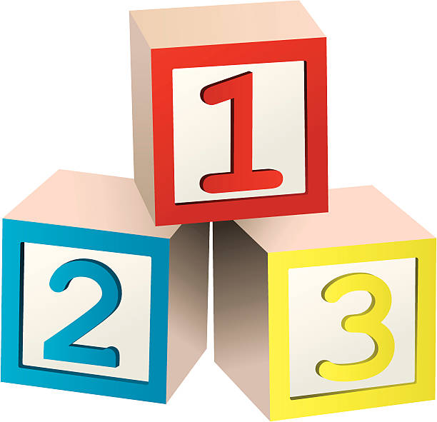

## What is Probability?
Probability gives us a way to measure <strong>uncertainty</strong>.
<div style="display: flex; align-items: center; gap: 150px;">
  <div>
    <span> It helps answer questions like:
    </span>
    <ul>
      <li>What's the chance it rains today?</li>
      <li>What are the odds that Portugal wins the World Cup?</li>
      <li>What is the chance I roll a 4 with a dice?</li>
    </ul>
  </div>
  <div>
    
  </div>
</div>

---

## Lecture Activity: How do we calculate it?

You and your buddies are playing a game where the one that rolls a value less than 3 wins an ice cream from Jenni's. Your freinds 6 sided dice that seems suspicious. You want to try to find the probability of rolling a 2 so you steal the dice once you're all done playing.

How would you go about this?

**Talk to your neighbor and come up with a plan. We'll talk together after!**

---

## You Already Do This!

Believe it or not, you already have a **natural intuition** for probability — especially when you *try something out* and notice patterns.

That’s your brain **estimating probability** through experience:

- Try something many times
- Keep track of how often the thing you care about happens
- Divide!

```python
approx_prob = num_successes / num_trials
```
<br>

---
## What is an Experiment?

An **experiment** is any repeatable action where the result isn’t known in advance but can be observed.

- **Medical Trial**: Give a new drug to a group of patients and record whether their condition improves  

- **Airport Security Check**: Randomly inspect bags and observe whether contraband is found  

- **Hiring Process**: Interview a candidate and decide whether they’re offered the job  

--- 
## What is an Experiment?

In an **experiment**, we usually know what the outcome could be even if we don't know what they are.

- **Medical Trial** : Improve, Stagnant, Worsen 
- **Airport Security Check** : Screened, Not-Screened
- **Hiring Process** : Hired, Not-Hired, Blacklisted
> The possible outcomes of an experiment are its **sample space**.


---
## Sample Space

The **sample space** is the set of all possible outcomes for a given experiment. 

If we flip a coin: `{Heads, Tails}`

If we roll a dice: `{1, 2, 3, 4, 5, 6}`

If we draw a card from a deck: `S = {A♠, 2♠, 3♠, K♠, A♥, 2♥,...}`

---
## Types of Experiments

Experiments can be grouped by the form of their outcomes:

- **Binary**: Two possible outcomes  
  Example: `{Success, Failure}` in a medical trial

- **Discrete**: Countable outcomes  
  Example: `{1, 2, 3, 4, 5, 6}` from rolling a dice

- **Continuous**: Any value in a range *(not something we'll focus on)*
  Example: A temperature reading like `72.5°F`

The structure of the sample space affects how we study the experiment and calculate the probabilities of its outcomes.

---

## Event Space

An **event** is a portion of the sample space we ascribe meaning to.

It represents outcomes of an experiment that satisfy a specific condition.

At least one Tails in two coin flips:
- Sample Space: `{ (T, T), (T, H), (H, T) }`

Values greater than a 3 in a dice roll:
- Sample Space: `{4, 5, 6}`

Red face cards in a card deck: 
- Sample Space:`{J♥, Q♥, K♥, J♦, Q♦, K♦}`

---

# Counting 



<!-- _class: lead -->

---

## Equally Likely Outcomes

When outcomes are equally likely, each outcome has the **same probability of occurring**.

Common examples include choosing a card from a card deck (as they're all unique), the outcome of a dice, outcome of a coin flip, and many more.  

To calculate the probability of an equally likely outcome, we can *count* the number of ways we can get the outcome. 

---

## Equally Likely Outcomes

To calculate the probability of an equally likely outcome, we can *count* the number of ways we can get the outcome. 

But, you already knew this! Hence why you could imagine the Probability of rolling a 1 to be:
$$\frac{1}{6} = \frac{\text{Ways to roll a 1}}{\text{All the ways to roll.}}$$

---

## Lecture Activity: Counting

Counting is one of the biggest painpoints for many undergrads! We thought we learned how to do so in elementary school but that isn't really the case.

Still, we can handle some basic counting. Consider the following: 

**If I roll two dice, how many ways can I get a 1 and a 2?**

Then also consider the following: 

**What is the sample space when rolling two dice?**

---

## Lecture Activity: Counting

**If I roll two dice, how many ways can I get a 1 and a 2?**
There are *two ways* to get a 1 and a 2. Either we can roll a (1,2) or a (2,1).   

**What is the sample space when rolling two dice?**
There are 36 possible outcomes! How could you calculate this? 

For each outcome of the first dice, there are 6 outcomes of the second dice. `6x6`.

So overall, what is the probability of rolling a 1 and 2? 

$$P(1 \text{ and } 2) = \frac{2}{36} = \frac{\text{event space}}{\text{sample space}}$$

--- 
### Rule of Product 

Stated simply, it is the intuitive idea that if there are **$a$** ways of doing something and **$b$** ways of doing another thing, then there are **$a · b$** ways of performing both actions.

For the first dice, there are **$6$** different outcomes. For the second dice, there are **$6$** different outcomes. So together, there are **$a · b$** different outcomes.

> $$\text{This is usually something that is just a \textit{given}, but it is something that is incredibly useful!}$$


---

# Formalizing Probability 

<!-- _class: lead -->

---

## Formal Definition of Probability

The **probability** of an event `E` is the *long-run* proportion of times `E` occurs in
 repeated, identical trials:

$$
P(\text{Event}) = \lim_{n \to \infty} \frac{\text{count(Event)}}{n}
$$

- Run an experiment many times—each trial could result in some event **E**.
- As the number of trials approaches infinity, this ratio converges to the true probability.

**In real life?** We usually don’t know the exact `P(Event)`. But this lets us estimate it. And it works surprisingly well.

---

## Trials Instead of Counting

If we repeat an experiment many times, the **relative frequency** of an event approaches its true probability.

So instead of counting, let's simulate rolling two dice `36000` times seeing how many times we roll a 1 and a 2.

--- 

## Trials Instead of Counting

* You won’t get *exactly* 2,000 outcomes of a 1 and 2.
* But the proportion of outcomes gets *closer and closer* to the real value as the trials increase.


<pre>
num_trials = 36000
num_outcomes = dice_outcomes(num_trials)
print(num_outcomes / num_trials)  # ≈ .05555555555
</pre>


---
## Key Terms Recap

| Term            | Meaning                                              |
|-----------------|------------------------------------------------------|
| **Experiment**  | A repeatable action with an uncertain outcome        |
| **Sample Space**| The set of all possible outcomes                     |
| **Event**       | A subset of outcomes we care about                   |
| **Trial**       | One run of the experiment                            |
| **Probability** | Chance of an event happening, between 0 and 1    |

---

## Python’s **random** Library

`random.randint(a, b)`  
Returns a random integer between `a` and `b` (inclusive). 
Example: `random.randint(1, 6) : {1, 2, 3, 4, 5, 6}`

`random.choice(seq)`  
Picks a random element from a sequence. All are equally likely.  
Example: `random.choice(["heads", "tails"])`

`random.random()`  
Returns a float between `0.0` and `1.0`.Can be used to simulate binary outcomes. 
Example: `random.random() < 0.5`

---

## Approximating Probability

We can estimate probabilities with **experiments** or **simulations** using mainly those three functions in the previous slide.

**Estimating probability of Celtics winning the championship**
<pre>
success = 0
for i in range(10000):
    if winner_of_nba_championship() == "celtics":
        success += 1
print(success / 10000)
</pre>

This is what you'll do today. The challenge lies in representing the experiment accurately!

---

## Lecture Activity: Approximating Probability

Let's go ahead and imagine we conducted 9 experiments where we rolled a die. We are interested in the probability of rolling a 2, 4, and 5 with a six sided die respectively.

The outcomes of the trial: `{5, 2, 6, 1, 4, 2, 2, 5, 6}`

Based on these outcomes, what are the estimated probabilities?

*Aside: does this method work for finding the probability of any of the possible outcomes in the sample space?*

*If it does, why? If not, for which doesn't it work?*

---

## Mutually Exclusive Events

**Mutually Exclusive:**
When two (or more) events are mutually exclusive, this means that they can not happen at the same time. 
- For example, rolling a value < 2 and rolling >= 2. 
- If X represents the outcome of the dice roll, $P(X < 2 \text{ and } X >=2) = 0$.


--- 

## Probability of OR

**OR**: Event A *or* Event B (or both) happen

If A and B are **mutually exclusive**:

$$P(A \text{ or } B) = P(A \cup B)= P(A) + P(B)$$

You can see `or` written written in either of those two ways above, but the syntax for us doesn't matter.

---

## Probability of Or

If A and B are **not mutually exclusive**, that is they *can* co-occur:

$$P(A \text{ or } B) = P(A \cup B)= P(A) + P(B) - P(A \text{ and }B)$$

<div style="display: flex; justify-content: center;">

</div>

---

## Probability of Or
Why do we subtract by $P(A \text{ and }B)?$
<div style="display: flex; align-items: center; gap: 110px;">
  <div>
    <ul>
      <li>If two events are not mutually exclusive, then they could co-occur.</li>
      <li>So, when adding together P(A) and P(B), we could be overcoutning the overlap!</li>
      <li>If they're mutually exclusive, P(A and B) is 0!</li>
    </ul>
  </div>
  <div>
    
  </div>
</div>

---

## Lecture Activity

Suppose we survey 100 students:

- 60 take **Math** → `P(Math) = 0.60`  
- 40 take **Science** → `P(Science) = 0.40`  
<!-- - 20 take **both** → `P(Math and Science) = 0.20` -->

Then:
<pre>
P(Math or Science) = P(Math) + P(Science) - P(Math and Science)
                   = 0.60 + 0.40
                   = 1
</pre>

**Is there anything wrong with this?**

---

## Probability of And

You might see this written in different forms, but they all express the same idea.

$$P(A \text{ and } B) = P(A = a, B = b) = P(A \cap B)$$

**AND**: 
- Event A *and* Event B both happen 
- Event a *and* b happen from the sample space of A and B.

There are many ways to calculate this probability directly. Assuming that each outcome is equally likely, we can count those outcomes. 

---

## Lecture Activity: Probability of "And"

You flip **three fair coins**.  
What’s the probability of getting a head, a head, and a tail?

Step 1: List all possible outcomes. (Sample Space)

Step 2: Count outcomes with **exactly two Heads and one Tail**  (Event Space)

Step 3: Compute probability  
```python
P(Head, Head, Tail) = ...
```

---

## Conditional Probability

**$P(A \mid B)$** : The probability of A given B. The probability that A happens **assuming** B has already happened.

$$P(A \mid B) = \frac{P(A \text{ and } B)}{P(B)}$$


Example:
What’s the probability a card is a Queen given it’s a face card?


$$P(Queen | Face) = \frac{P(Queen \text{ and } Face)}{Face} = \frac{4}{12}$$ 

*There is an implicit / 52 under each value, but they cancel!*

---

## Chain Rule

Sometimes we can’t calculate $P(A \text{ and } B)$ directly.  
We use the **chain rule**, which rewrites it using conditional probability:

$$
P(A \text{ and } B) = P(A) \cdot P(B \mid A)
$$

$$
P(Queen \text{ and } Face) = P(Queen) \cdot P(Face \mid Queen)
$$
$$ = \frac{4}{52} \cdot \frac{4}{4} $$

---

## Expectation

The **expected value** is the long-run *"average"* if you repeat an experiment.

$$
E[X] = \sum (\text{value} \times \text{probability of that value})
$$

**Example: Expected value of rolling a fair 6-sided dice**

$$
E = 1 \cdot \frac{1}{6} + 2 \cdot \frac{1}{6} + 3 \cdot \frac{1}{6} + 4 \cdot \frac{1}{6} + 5 \cdot \frac{1}{6} + 6 \cdot \frac{1}{6} = 3.5
$$


Even though you never actually roll a 3.5, it’s the expected value over time.

---

## Expected Value (Formal Definition)

If $X$ is the outcome of an experiment, the **expected value** is the average outcome you'd expect over many repetitions:

$$
E[X] = \sum_{x} x \cdot P(X = x)
$$

Example:  
Let the possible outcomes be $[1, 2, 3]$ with probabilities $[0.2, 0.3, 0.5]$

$$
E[X] = 1 \cdot 0.2 + 2 \cdot 0.3 + 3 \cdot 0.5 = 2.3
$$

This is a weighted average — values that are more likely contribute more.


---

## Bernoulli Random Variable: Win or Lose

A **Bernoulli random variable** represents a single trial with two outcomes:

Let $X$ be a random variable such that:

- $X = 1$ if you **win** the game  
- $X = 0$ if you **lose** the game
- $P(X = 1) = p$ , $P(X = 0) = 1 - p$


$$
E[X] = 1 \cdot p + 0 \cdot (1 - p) = p
$$

$X$ models the outcome of a binary scenario. Its expectation equals the **probability of winning**.

---

## Revist: Chain Rule

The chain rule helps compute the probability that two events both happen:

$$
P(A \text{ and } B) = P(A) \cdot P(B \mid A)
$$

If **A and B are independent**, then:

$$
P(B \mid A) = P(B)
$$

So:

$$
P(A \text{ and } B) = P(A) \cdot P(B)
$$

 Independence means the outcome of A does not affect the probability of B.

---

## Multiple Bernoulli Trials

If $X_1, X_2, \dots, X_n$ are **independent** Bernoulli random variables:
Each $X_i$ represents a trial with:
- $X_i = 1$ (success) with probability $p$
 - $X_i = 0$ (failure) with probability $1 - p$

Then the probability of a specific outcome, like:
$$
X_1 = 1, X_2 = 0, X_3 = 1
$$
$$
P(X_1 = 1, X_2 = 0, X_3 = 1) = p \cdot (1 - p) \cdot p = p^2 (1 - p)
$$

---
## Expectation Over Multiple Bernoulli Trials

Let $X_1, X_2, \dots, X_n$ be $n$ independent Bernoulli random variables, each with:

- $X_i = 1$ (success) with probability $p$  
- $X_i = 0$ (failure) with probability $1 - p$

Define the total number of successes:

$$
S = X_1 + X_2 + \dots + X_n
$$

Then the expected number of successes is:

$$
E[S] = E[X_1] + E[X_2] + \dots + E[X_n] = n \cdot p
$$

---
## The Normal Distribution

<div style="display: flex; align-items: center; gap: 60px;">

<div style="flex: 1;">
The <strong>normal distribution</strong> is a smooth, bell-shaped curve.  
It models things that vary slightly around an average — like player performance, or anything!

We write it as: $
X \sim \text{Normal}(\mu, \sigma)
$

- $\mu$ is the **mean** (average)  
- $\sigma$ is the **standard deviation** (spread)  
</div>

<div style="flex: 1;">
  
</div>

</div>

---

## Lecture Activity: Are they independant?

Two players each play **3 games** against the same AI:

- Player A has a **60%** chance of winning each game  
- Player B has a **70%** chance of winning each game

**Question:**  
Based on the setup, are the outcomes of Player A and Player B independent?

---


## Lecture Activity: How Many Games Should They Win?

Two players each play **3 games** against the same AI:

- Player A has a **60%** chance of winning each game  
- Player B has a **70%** chance of winning each game

**Question:**  
What is the **expected number of games** each player will win?

---

## Lecture Activity: Probability Each Wins a Majority

Two players each play **3 games** against the same AI:

- Player A wins each game with probability **0.6**  
- Player B wins each game with probability **0.7**

**Question:**  
What is the probability that each player wins **at least 2 out of 3 games**?

---

### Player A:
**Majority Win Outcomes**

$P(\text{Win-Win-Loss}) = 0.6 \cdot 0.6 \cdot 0.4 = 0.144$  
$P(\text{Win-Loss-Win}) = 0.6 \cdot 0.4 \cdot 0.6 = 0.144$  
$P(\text{Loss-Win-Win}) = 0.4 \cdot 0.6 \cdot 0.6 = 0.144$  
$P(\text{Win-Win-Win}) = 0.6 \cdot 0.6 \cdot 0.6 = 0.216$

**Total:**  
$$
P(\text{Majority}) = 0.144 \cdot 3 + 0.216 = 0.648
$$

*Make sure to enumerate all ways one can win a game!* 

---

### Player B:

Same logic with win probability of 0.7:

$$
P(\text{B wins majority}) = 3 \cdot (0.7)^2 \cdot (0.3) + (0.7)^3
$$

$$
= 3 \cdot 0.49 \cdot 0.3 + 0.343 = 0.441 + 0.343 = 0.784
$$

> Add the probabilities of all outcomes where the player wins 2 or 3 games.

---

## Challenge: Who Wins More Games?

Two players each play **3 games** against the same AI:

- Player A wins each game with probability **0.6**  
- Player B wins each game with probability **0.7**

**Question:**  
What is the probability that **Player A wins more games than Player B**?

To solve this, you'd need to first find how many ways this is possible! Then you can figure out the probabilities from there. 

---

## Challenge: Comparing Two Random Outcomes

To compute: $P(X_A > X_B)$


Where $X_A$ and $X_B$ are the number of wins for each player:
This involves a process called **convolution** — combining the probabilities of two random variables.
We won't go into the full details now, but at a high level:
- You compute the probability of each pair $(a, b)$  
- Then sum the probabilities where $a > b$

**But, why bother with the math if you can simulate it?**

---
## Monte-Carlo Simulations

**Monte-Carlo**:

* You simulate a random process many times.
* Approximate the answer by averaging the results!

Sounds simple, right?

---

## Monte Carlo Activity: Student Success Under Uncertainty

Two students are enrolled in a challenging course.  
They each take **10 quizzes**. 
- $P(\text{pass}) \sim \text{Normal}(\mu, \sigma^2)$  
We will say that each student's performance can be modeled by a Normal Distribution, where they pass on average with probability $\mu$ with a variance of $\sigma^2$. 

We want to estimate:  
**What’s the probability that each student passes the course?**

---

## Step 1: Modeling Daily Performance

Some days are better than others — sleep, stress, focus, etc.  
We use a **normal distribution** to model this variation in daily quiz performance.

- **Student A**: well-prepared, consistent  
  - $P(\text{pass}) \sim \text{Normal}(0.8, 0.1)$  
- **Student B**: struggles more, less consistent  
  - $P(\text{pass}) \sim \text{Normal}(0.6, 0.15)$

*This is purely an example, student progress is not stagnant across an entire semester.*

---

## Step 2: Simulate the 10 Quizzes

Each day, simulate whether the student passes:

<pre>
student_A_prob = Normal(0.8, 0.1)
A_passes = count of 10 quizzes where Random() < student_A_prob
</pre>

Do the same for Student B using their distribution.
Each quiz is treated as a **Bernoulli trial** with a sampled probability of success.

---

## Step 3: Define What It Means to Pass

We’ll say a student **passes the course** if they pass at least **7 out of 10 quizzes**.

In each simulation:

<pre>
if A_passes >= 7: A_success += 1
if B_passes >= 7: B_success += 1
</pre>

Repeat this process across **100,000 trials** to get stable estimates.

---

## Step 4: Estimate the Probabilities

After running all simulations:

<pre>
P(Student A passes) = A_success / trials  
P(Student B passes) = B_success / trials
</pre>

This gives us a data-driven estimate of how often each student passes,
accounting for randomness and personal variation.

---

## Why Monte Carlo?

Academic success isn’t deterministic.
It fluctuates due to **real-world randomness** — stress, health, energy, etc.

Monte Carlo lets us simulate:

* Variability in student performance
* Long-run expectations
* Comparative outcomes under uncertainty

**When exact math is messy or impossible, simulation gives us clarity**

--- 

## Why Simulations Work

When we simulate something thousands of times, the **relative frequencies** begin to match the true probabilities.

This is the **Law of Large Numbers**:

*As the number of trials increases, the average result gets closer to the expected value.*

It’s why Monte Carlo methods are so powerful — you don’t need to solve every problem exactly to understand it well.

---

## Recap

* Probability measures uncertainty
* Sample space = all outcomes; Event space = subset
* Approximating probability: try a lot and count
* Use `and`, `or`, chain rule, and (baby) Bayes to combine probabilities
* Expectation = long-run average, with weights if needed
* Bootstrapping and Monte-Carlo use randomness to get smart
